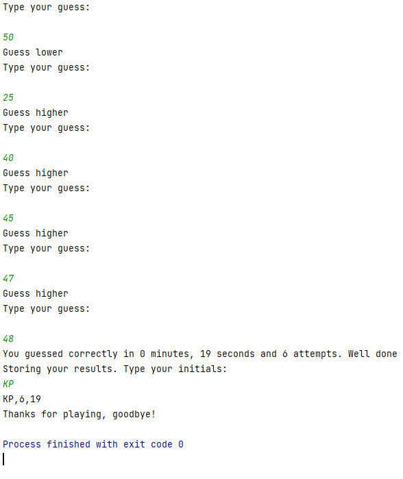

# guessTheNumber
The result of a speedrun programming stretch task to create a guess the number game.
Also times you and stores your results in a CSV file.

Test case 1:

Test case 2:

Test case 3:

